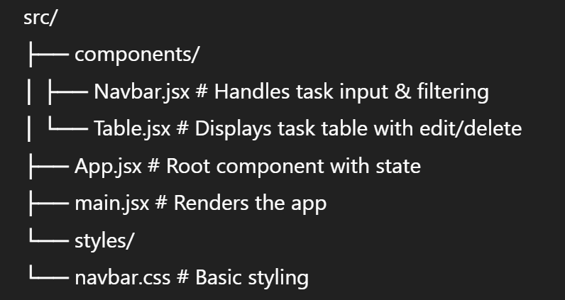

# 📝 To-Do List Application – React + Vite

This is a dynamic To-Do List application built with **React**, powered by **Vite** for lightning-fast development and hot module replacement (HMR).

It allows users to:
- ✅ Add tasks with categories (Daily, Weekly, Monthly, Year)
- ✅ Edit tasks inline with save functionality
- ✅ Delete tasks with a single click
- ✅ Filter tasks by duration category

---

## 🚀 Features

- **Real-time task editing**
- **Inline delete/edit icons using `react-icons`**
- **Filterable views** to focus on Daily, Weekly, Monthly, or Yearly tasks
- **React hooks (useState, useEffect)** for clean state management
- Built on **Vite** for fast startup and rebuilds

---

## 🧩 Tech Stack

- **React**
- **Vite**
- **React Icons**
- **CSS / Custom Styling**
- Optional ESLint + Prettier (if enabled via template)

---

## 📂 Folder Structure


---

## ▶️ Getting Started

```bash
# Install dependencies
npm install

# Run the development server
npm run dev

